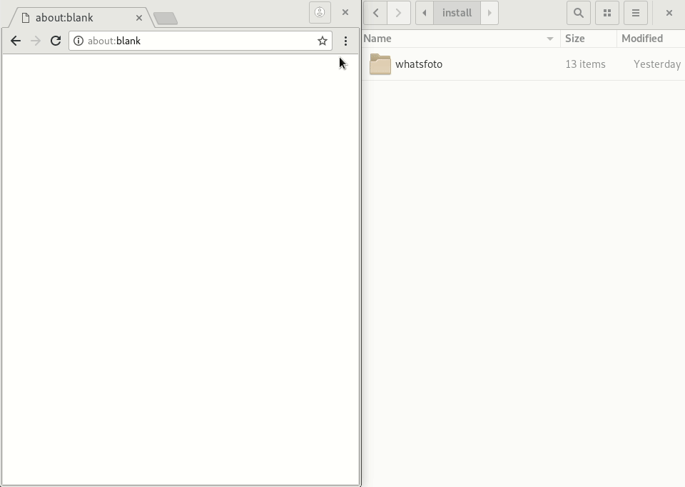

# WhatsFoto


Simple tool to download multiple profile pictures from whatsapp. Its an extensions for Chrome


# Install

Download the zip or folder and drag it into your extension.



Make sure you enable developer mode. Or use a zip file.


# Howto

Login to web.whatsapp.com

Click on the icon, enter phone numbers in csv like:
```
31600000000,
06-12345678
```

Numbers starting with 06 will replaced with 316

All pictures are stored in a zip file

# Todo

Todo :triumph:

:red_circle:  test

:large_blue_circle: split numbers new line

:large_blue_circle: get feedback


# Licence
Mit
Based on chrome extension Loran Kloeze :).
